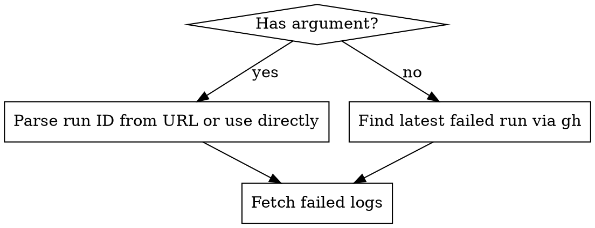

# Fix CI

Diagnose a GitHub Actions failure and fix the root cause in code.

## Input

`$ARGUMENTS` is a GitHub Actions run URL, run ID, or empty (defaults to latest failed run).

## Steps

### 1. Identify the run



- If `$ARGUMENTS` is a full URL like `https://github.com/OWNER/REPO/actions/runs/12345/job/67890`, extract the run ID (`12345`).
- If `$ARGUMENTS` is just a number, use it as the run ID.
- If `$ARGUMENTS` is empty, run: `gh run list --status failure --limit 1 --json databaseId --jq '.[0].databaseId'` to get the latest failed run.

### 2. Fetch failure details

Run these commands to gather context:

```bash
# Get run metadata (name, branch, event, conclusion)
gh run view <RUN_ID> --json name,headBranch,event,conclusion,jobs

# Get ONLY the failed job logs (concise)
gh run view <RUN_ID> --log-failed
```

### 3. Analyze the failure

Read the failed logs carefully. Identify:

- **Which job and step failed** (job name + step name from the log prefix)
- **The root error** (not just the exit code -- find the actual error message, assertion failure, or broken pipe, etc.)
- **Whether it's a code bug, CI config issue, or flaky/environment issue**

### 4. Read relevant source files

Based on the error, read the files involved. Do NOT guess at fixes without reading the current code first.

### 5. Implement the fix

- Fix the root cause, not symptoms.
- Keep changes minimal and focused on the failure.
- Do not refactor surrounding code or add unrelated improvements.

### 6. Verify locally

Run the same checks that failed in CI locally to confirm the fix works. For this repo:

```bash
bash -n install.sh                         # Syntax check
shellcheck install.sh                      # Lint
bats tests/                                # Unit tests (if bats is installed)
DRY_RUN=1 bash install.sh --full           # Smoke test full flow
DRY_RUN=1 bash install.sh --adguard-only   # Smoke test adguard-only flow
```

Only report success after seeing passing output.

### 7. Summarize

Tell the user:
- What failed and why (one sentence)
- What you changed and why (one sentence)
- Verification results
